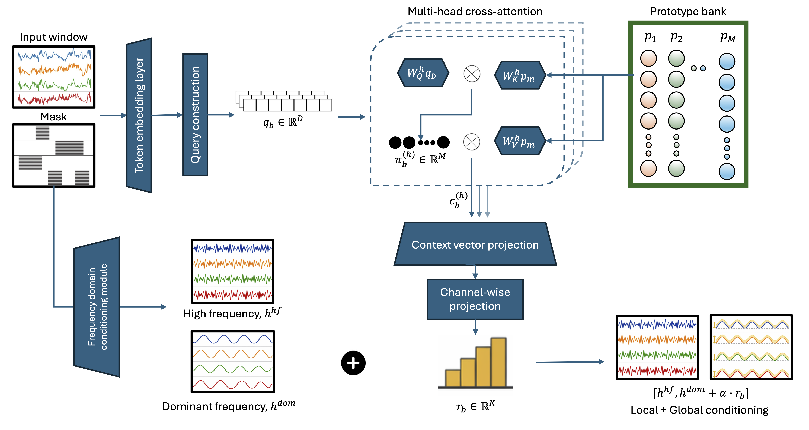

<div align="left">

# ProCTI: Prototype-Refined Global Conditioning for Diffusion-Based Time Series Imputation

**Fariza Rashid, Duc Van Le, Rahat Masood, Gustavo Batista, Aruna Seneviratne, Suranga Seneviratne**

University of Sydney · University of New South Wales


[](https://arxiv.org/pdf/2609.37632)



</div>

---

## Overview

Diffusion-based imputation methods typically condition the reverse process on **local** context from the current or neighbouring windows, leaving dataset-level structure implicit. When local observations are sparse, noisy, or unrepresentative, that context can be insufficient.

**ProCTI** augments local conditioning with **global** dataset-level priors retrieved from a learnable prototype bank:

- Each partially observed window queries a bank of learned prototypes via multi-head cross-attention, producing a window-specific **regime vector**.
- The regime vector is injected into the dominant-frequency branch of a frequency-aware diffusion backbone, with a learnable scale α controlling the strength of global correction.
- A latent-regime analysis characterises **when** prototype-derived global conditioning provably improves imputation, and when it cannot (e.g. under strong cross-feature redundancy).
---

## Repository Structure

```
ProCTI/
├── run_full_pipeline.sh     # end-to-end pipeline
├── requirements.txt
├── data/                    # datasets
├── maskbanks/               # shared Markov evaluation masks
├── channeldropassets/       # attribute-wise (channel-drop) assets
├── ProCTI/                  # ProCTI model and experiment scripts
├── baselines/               # baseline implementations
└── _pipeline_logs/          # per-step pipeline logs
```

## Quick Start

```bash
python3 -m venv venv
source venv/bin/activate
pip install --upgrade pip
pip install -r requirements.txt

chmod +x run_full_pipeline.sh
./run_full_pipeline.sh
```

> Depending on your CUDA / GPU setup, you may need to reinstall PyTorch separately.

## What the Pipeline Does

`run_full_pipeline.sh` runs the following steps and saves logs, outputs, metrics, and intermediate assets.

<details>
<summary><b>Step 1 — Generate shared Markov maskbanks</b></summary>

Creates identical evaluation masks for fair benchmarking across models, for Beijing, Gait, PhysioNet, Stock, and Weather.

Scripts: `make_beijing_maskbank.py`, `make_gait_maskbank.py`, `make_physionet_maskbank.py`, `make_stock_maskbank.py`, `make_weather_maskbank.py`
Output: `maskbanks/`
</details>

<details>
<summary><b>Step 2 — Generate channel-drop assets (attribute-wise missingness)</b></summary>

Scripts: `make_beijing_channeldrop_assets.py`, `make_weather_channeldrop_assets.py`, `make_shared_channeldrop_assets.py`, `make_physionet_channeldrop_assets_patientwise.py`, `make_gait_channeldrop_assets_userwise.py`
Output: `channeldropassets/`
</details>

<details>
<summary><b>Step 3 — Run ProCTI experiments</b></summary>

- `ProCTI/run_procti_markovmask_10seeds.sh` — random Markov missingness
- `ProCTI/run_procti_channeldrop_available_seeds.sh` — attribute-wise missingness
- `ProCTI/run_procti_ablations.sh` — ablation studies
</details>

## Reproducibility

- **Seeds (default):** 1–10
- **Missing ratios:** 10%, 30%, 50%, 70%

## Citation

If you find ProCTI useful in your research, please cite:

```bibtex
@inproceedings{rashid2026procti,
  title     = {{ProCTI}: Prototype-Refined Global Conditioning for Diffusion-Based Time Series Imputation},
  author    = {Rashid, Fariza and Le, Duc Van and Masood, Rahat and Batista, Gustavo and Seneviratne, Aruna and Seneviratne, Suranga},
  booktitle = {Advances in Neural Information Processing Systems},
  year      = {2026}
}
```


Baselines were run using the following repositories, each subject to its own open-source license:
[BRITS](https://github.com/Graph-Machine-Learning-Group/spin/tree/main) ·
[CSDI](https://github.com/ermongroup/CSDI/tree/main) ·
[SCINet](https://github.com/cure-lab/SCINet) ·
[TIDER](https://github.com/liuwj2000/TIDER) ·
[MTSCI](https://github.com/JeremyChou28/MTSCI) ·
[Diffusion-TS](https://github.com/Y-debug-sys/Diffusion-TS/tree/main) ·
[iTransformer](https://github.com/thuml/Time-Series-Library) ·
[FGTI](https://github.com/FGTI2024/FGTI24/tree/main) ·
[PaD-TS](https://github.com/wmd3i/PaD-TS)


